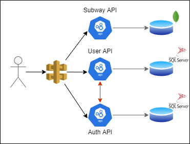

# NYCSS (NYC Subway Stations)

THE NYCSS is an API based the subway stations from New York.

## Features:

### Subway stations list

//Ver o que é possível fazer com API de metrô ou com buscas no Google para detalhar a estação selecionada

- ID
- Name
- Location
- Street
- Photo

### User's profile

#### User's more frequent stations

//Inserir mais de uma estação e criar flag para contar quantas vezes o usuário esteve na estação. Resonse com array e query com parâmetro de quantidade

#### User's profile details

- ID
- FirstName
- LasName
- Age
- Photo
- Stations

## Technical:

### Architecture

